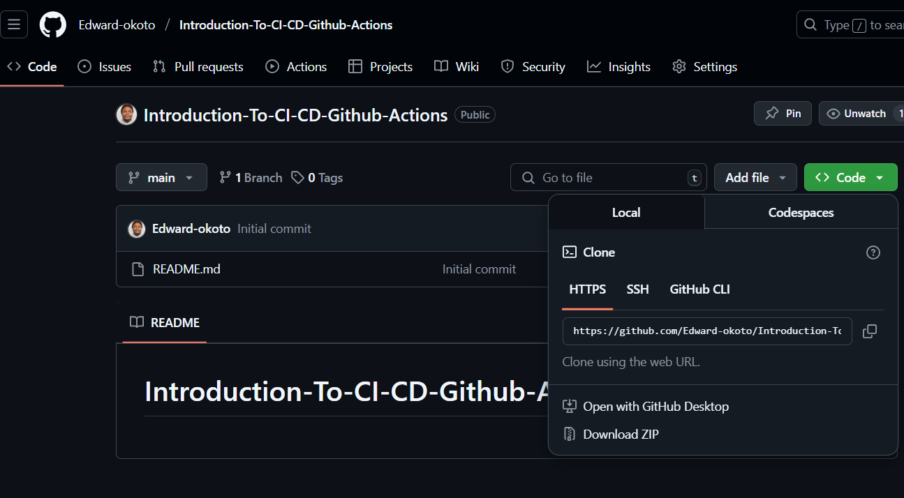
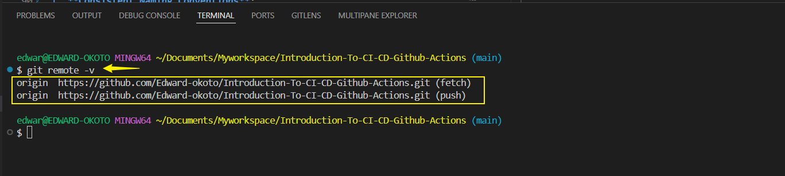
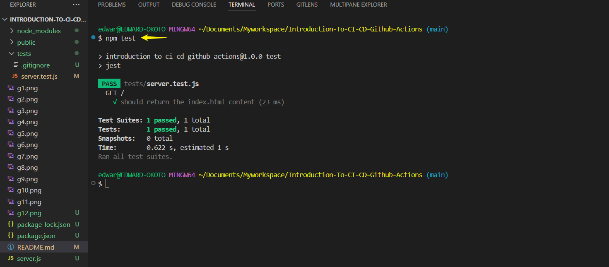
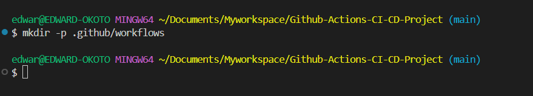
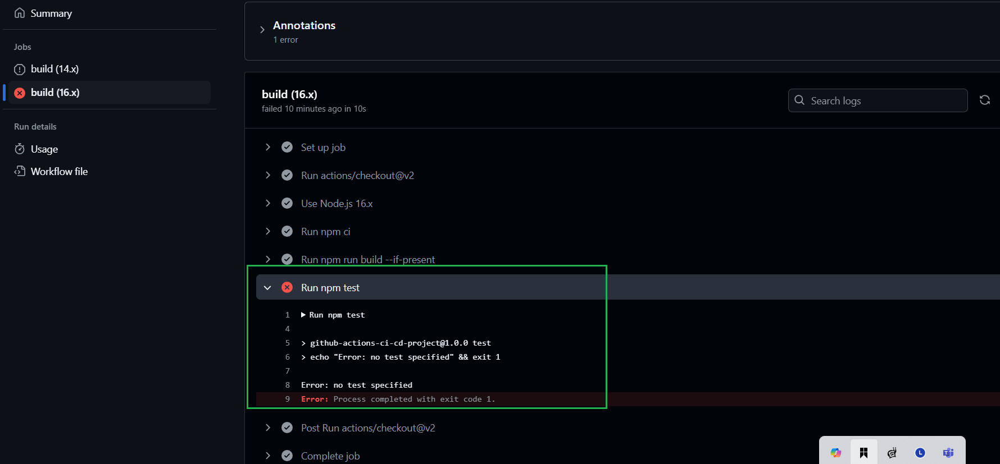
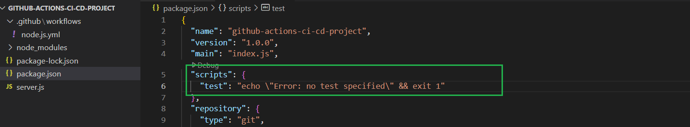
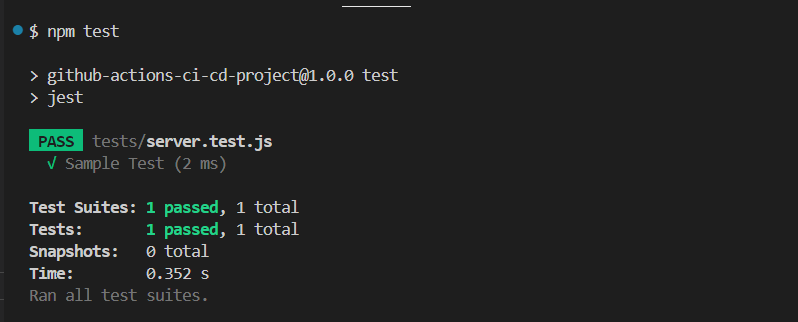
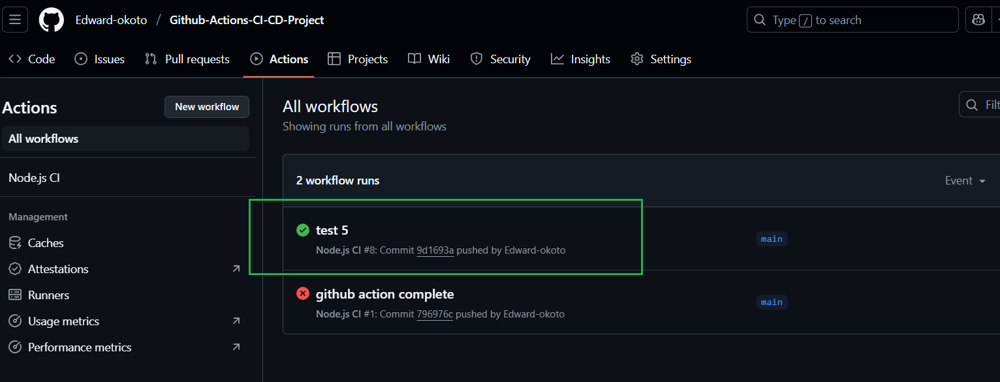

# Introduction-To-CI/CD-Github-Actions.

GitHub Actions is a powerful tool for automating tasks within your repositories. It's widely used for implementing Continuous Integration and Continuous Deployment (CI/CD) pipelines, which streamline the development process by automating code testing, building, and deployment.

With CI/CD pipelines, changes made to code are automatically tested and validated, ensuring quality and reducing the likelihood of errors. GitHub Actions allows developers to define workflows in YAML files, specifying triggers (such as a push to a branch) and actions (like running tests or deploying an application).

By integrating GitHub Actions and CI/CD, teams can collaborate efficiently, ship code faster, and maintain a high level of reliability in their software development processes.

#### Why is this relevant to LEARNERS

The relevance of GitHub Actions and CI/CD pipelines lies in their ability to improve software development efficiency, quality, and collaboration:

1. **Automation of Repetitive Tasks**: They eliminate manual steps like testing, building, or deployment, allowing developers to focus on writing code.

2. **Continuous Feedback**: CI/CD pipelines provide immediate feedback on code changes, helping teams catch bugs early and ensure the reliability of their applications.

3. **Faster Delivery**: Automation accelerates the process of deploying new features and updates, enabling quicker time-to-market.

4. **Collaboration**: Teams can work more cohesively, as GitHub Actions integrates seamlessly into pull requests and version control workflows.

By streamlining the development and deployment process, these tools are essential for modern software engineering teams aiming to build robust and scalable applications.

#### Practical Implementation

**Setting up the project**.

1.**Initialize a Git repository**.

Here's a professionally rewritten version of the steps for setting up and initializing your project repository. I've also incorporated best practices and testing recommendations to ensure an effective workflow:

---

**Setting Up the Project: A Professional Guide**

---

### **Step 1: Initialize a Git Repository**

A Git repository serves as the foundation for your project, enabling collaboration and version control. Below is a structured approach to create and set up your repository.

#### **1. Create a New Repository on GitHub**
To establish the repository on GitHub, follow these steps:

- **Log In**: Access your GitHub account via [GitHub.com](https://github.com).
- **Create Repository**:
  - Click the `+` icon located in the top-right corner and select **New Repository**.
  - Enter the repository **name**, a **description**, and specify its visibility (**public** or **private**).
  - Add essential files:
    - A **README.md** file to document the project.
    - A **.gitignore** file to exclude unnecessary files from version control.
  - Click **Create Repository**.

#### **2. Clone the Repository to Your Local Machine**
Once the repository is created, clone it to your local development environment:

- **Copy Repository URL**: In your repository's GitHub page, click the **Code** button to copy the HTTPS or SSH URL.

  
- **Clone and Navigate to Directory**:
  1. Open your terminal.
  2. Run the following commands:
     ```bash
     git clone <repository_url>
     cd <repository_name>
     ```

    ```
   git clone https://github.com/Edward-okoto/Introduction-To-CI-CD-Github-Actions.git

    cd Introduction-To-CI-CD-Github-Actions
    ```
  This will download the repository and navigate to its root directory (Introduction-To-CI-CD-Github-Actions).

#### **Testing**
- **Check for Git Installation**:
  Ensure `git` is installed on your machine:
  ```bash
  git --version
  ```
  If the command returns an error, install Git from the [official site](https://git-scm.com).

- **Verify Connectivity**:
  After cloning the repository, ensure that you are connected to GitHub by running:
  ```bash
  git remote -v
  ```
  The output should list the repository URL under `origin`.

  

#### **Best Practices**
1. **Consistent Naming Conventions**:
   Use descriptive names for repositories that reflect the project purpose, e.g., `my-node-app`.
2. **Commit Regularly**:
   - Make atomic, meaningful commits with clear messages (e.g., `Added server.js with basic routing functionality`).
3. **Branching Strategy**:
   - Follow the Git Flow methodology for managing branches:
     - `main` for production-ready code.
     - `develop` for ongoing work.

#### **Recommended Tools**
- Use **Visual Studio Code** or another code editor that integrates well with Git for streamlined development.
- Consider installing the **GitHub CLI** for advanced command-line interaction.
---

### **Step 2: Create a simple Node.js application**
---

**Creating a Simple Node.js Application**

This section outlines the steps to set up a Node.js application, configure a simple server using `Express.js`, and include a static webpage (`index.html`) to be served to users.

#### **Step 1: Install Node.js**
Node.js is the runtime environment required to execute JavaScript code outside the browser. Install Node.js if it is not already installed:
- Visit the [Node.js official website](https://nodejs.org/en?form=MG0AV3) and download the appropriate version for your operating system.
- Verify the installation using the following commands:

  ```bash
  node -v
  npm -v
  ```
  This checks the installed versions of Node.js and npm (Node Package Manager).

#### **Step 2: Initialize a Node.js Project**
Initialize your project directory to set up `package.json`:
1. Navigate to your project folder in the terminal.
2. Run:
   ```bash
   npm init
   ```
3. Follow the prompts to configure the project. Press `Enter` to accept default values.

#### **Step 3: Install `Express.js`**
`Express.js` is a popular web framework for Node.js that facilitates server creation.
- Install Express.js by running:
  ```bash
  npm install express
  ```

#### **Step 4: Create the Server File**
Set up your server in a file named `server.js`:
1. Create a file named `server.js`.
2. Add the following code to define the server:
    ```javascript
    const express = require('express');
    const app = express();
    const port = process.env.PORT || 3000;

    // Middleware to serve static files from the "public" folder
    app.use(express.static('public'));

    // Route for the homepage
    app.get('/', (req, res) => {
        res.send('Hello World!');
    });

    app.listen(port, () => {
        console.log(`App is running at http://localhost:${port}`);
    });
    ```

#### **Step 5: Serve a Static Webpage**
To serve a static HTML page:
1. Create a folder named `public` in the root directory of your project.
2. Inside the `public` folder, create a file named `index.html` with the following content:
    ```html
    <!DOCTYPE html>
    <html>
    <head>
        <title>My Node.js App</title>
    </head>
    <body>
        <h1>Welcome to My Node.js App!</h1>
        <p>This is a static webpage served using Express.js.</p>
    </body>
    </html>
    ```

The `express.static` middleware in `server.js` automatically serves files from the `public` folder, including `index.html`.

#### **Step 6: Add Files to the Repository**
Push the newly created files to your GitHub repository:
1. Stage the files:
   ```bash
   git add .
   ```
2. Commit the changes:
   ```bash
   git commit -m "Added server.js and index.html"
   ```
3. Push to the repository:
   ```bash
   git push origin main
   ```

---

#### **Testing**
To ensure proper functionality:
1. **Run Locally**:
   - Start the server:
     ```bash
     node server.js
     ```
   - Visit [http://localhost:3000](http://localhost:3000) in your browser to confirm the static webpage is served.
   - Use  curl http://localhost:3000 locally.

2. **Debugging**:
   - Check the console for errors.
   - Use tools like Postman to test endpoint functionality.

---

#### **Best Practices**
1. **Project Structure**:
   - Keep files organized. Use folders like `public` for static assets.
2. **Security**:
   - Avoid exposing sensitive data in public repositories.
   - Use environment variables to store sensitive information (e.g., `.env` files).
3. **Documentation**:
   - Add comments to your code and a detailed README explaining the project setup.
4. **Testing Frameworks**:
   - Use tools like `Jest` for unit testing or `Mocha` for integration testing.
   To add Jest to your Node.js server for unit testing, follow these steps:

##### **Step 1: Install Jest**
Jest is a popular JavaScript testing framework that can be easily integrated into your Node.js project. To install Jest:
1. Run the following command to add Jest as a development dependency:
   ```bash
   npm install --save-dev jest
   ```

---

##### **Step 2: Add Jest to Your `package.json`**
Modify your `package.json` to include a script for running tests:
1. Open `package.json`.
2. In the `"scripts"` section, add:
   ```json
   "test": "jest"
   ```
3. Save the file. This allows you to run Jest by typing `npm test` in the terminal.

---

##### **Step 3: Create a Test Directory**
Organize your tests in a dedicated directory:
1. Create a folder named `tests` in your project root:
   ```bash
   mkdir tests
   ```
2. Inside `tests`, create a test file for your server, such as `server.test.js`.

---

##### **Step 4: Write Test Cases**
Add your unit tests in `server.test.js`. For example:
```javascript
const request = require('supertest');
const app = require('../server'); // Import your Express server

describe('GET /', () => {
    it('should return Hello World', async () => {
        const response = await request(app).get('/');
        expect(response.statusCode).toBe(200);
        expect(response.text).toBe('Hello World!');
    });
});
```
Here’s what’s happening:
- `request` from `supertest` is used to simulate HTTP requests to your Express server.
- `describe` defines a test suite.
- `it` specifies an individual test case.

---

##### **Step 5: Run Tests**
Run your tests with the following command:
```bash
npm test
```
If everything is set up correctly, Jest will execute the test cases and display the results in the terminal.

---



##### **Step 6: Debugging**
If any tests fail, Jest will provide a detailed error report to help you pinpoint the issue.

---

##### **Best Practices for Testing**
1. **Write Granular Tests**:
   - Cover edge cases and expected behaviors for each route and function.
2. **Mock External Dependencies**:
   - Use libraries like `jest.mock()` to simulate external services or modules.
3. **Continuous Integration**:
   - Integrate Jest into your CI/CD pipeline (e.g., GitHub Actions) to automate testing during every push or pull request.

---

### **Step 3: Write your GitHub action workflow**

- Create a `.github/workflow` in your repository

   a) In the root of your git repository,create the .github/workflow directory.

        mkdir -p .github/workflows
    
    

    b) Navigate to the workflows directory:

        cd .github/workflows
 
- Add a workflow file called `node.js.yml`

        touch node.js.yml

       


    ```
    # Name of the workflow
    name: Node.js CI

    # Specifies when the workflow should be triggered
    on:
      push:
        branches: [ main ]
      pull_request:
        branches: [ main ]

    # Defines the jobs that the workflow will execute
    jobs:
      build:
        # Specifies the type of virtual host environment (runner) to use
        runs-on: ubuntu-latest

        # Strategy for running the jobs - this section is useful for testing across multiple environments
        strategy:
          matrix:
            node-version: [14.x, 16.x]

        # Steps represent a sequence of tasks that will be executed as part of the job
        steps:
        - name: Checkout Code
          uses: actions/checkout@v2

        - name: Use Node.js ${{ matrix.node-version }}
          uses: actions/setup-node@v1
          with:
            node-version: ${{ matrix.node-version }}

        - name: Cache Node.js Modules
          uses: actions/cache@v3
          with:
            # The path to the directory to cache (node_modules)
            path: ~/.npm
            # A unique key for the cache, which includes the Node.js version and dependencies hash
            key: ${{ runner.os }}-node-${{ matrix.node-version }}-${{ hashFiles('**/package-lock.json') }}
            # Restore keys in case an exact match isn't found
            restore-keys: |
              ${{ runner.os }}-node-${{ matrix.node-version }}-

        - name: Install Dependencies
          run: npm ci
        
        - name: Run ESlint
          run: npm run lint

        - name: Build Application
          run: npm run build --if-present

        - name: Run Tests
          run: npm test
    ```

Explanation:

---

##### **Workflow Name**
```yaml
name: Node.js CI
```
- This specifies the name of the workflow. The name appears in the GitHub Actions dashboard, helping you identify the workflow.

##### **Workflow Trigger**
```yaml
on:
  push:
    branches: [ main ]
  pull_request:
    branches: [ main ]
```
- **`push:`**: The workflow is triggered when code is pushed to the `main` branch.
- **`pull_request:`**: The workflow is triggered when a pull request is opened, synchronized, or updated targeting the `main` branch.

##### **Job Definition**
```yaml
jobs:
  build:
    runs-on: ubuntu-latest
```
- **`jobs:`**: Defines the tasks (jobs) to be executed in the workflow. Each job can run independently.
- **`build:`**: The job identifier, which can be any name. In this case, it's `build`.
- **`runs-on:`**: Specifies the type of virtual machine environment to run the job. Here, it uses the latest Ubuntu environment (`ubuntu-latest`).

##### **Strategy for Matrix Builds**
```yaml
strategy:
  matrix:
    node-version: [14.x, 16.x]
```
- **`strategy:`**: Defines how the job runs across different configurations.
- **`matrix:`**: Creates a matrix of configurations for testing. The job will run multiple times, once for each version of Node.js (`14.x` and `16.x`).

---

##### **Steps**
```yaml
steps:
  - uses: actions/checkout@v2
```
- **`steps:`**: Defines the sequence of tasks to execute within the job.
- **`actions/checkout@v2:`**: Checks out the code from the repository into the workspace so that subsequent steps can access it.

##### **Set Up Node.js**
```yaml
- name: Use Node.js ${{ matrix.node-version }}
  uses: actions/setup-node@v1
  with:
    node-version: ${{ matrix.node-version }}
```
- **`name:`**: Provides a readable description for the step. It dynamically includes the Node.js version being tested.
- **`uses:`**: Specifies the GitHub Action to use. Here, it sets up Node.js with `actions/setup-node@v1`.
- **`with:`**: Supplies parameters for the action. The `node-version` parameter defines which version of Node.js to install, using the matrix variable.

`actions/cache@v3`:
- This action is used to cache and restore files to speed up workflows

##### **Install Dependencies**
```yaml
- run: npm ci
```
- **`run:`**: Executes shell commands. Here, `npm ci` installs dependencies listed in the `package-lock.json` file to ensure consistent builds.

##### **Build the Application**
```yaml
- run: npm run build --if-present
```
- Runs the build command defined in the `package.json` file, if it exists (`--if-present` ensures the workflow doesn't fail if there isn't a build script).

##### **Run Tests**
```yaml
- run: npm test
```
- Runs the test scripts defined in the `package.json` file to validate the application's functionality.

---

##### **Install ESLint**
1. Run the following command to install ESLint as a development dependency:
   ```bash
   npm install eslint --save-dev
   ```
2. Initialize an ESLint configuration file:
   ```bash
   npx eslint --init
   ```
   Follow the prompts to configure ESLint for the project. For example:
   - Select "To check syntax and find problems."
   - Choose your preferred module type (CommonJS or ES modules).
   - Select your project’s JavaScript framework (e.g., Node.js).
   - Choose a style guide, or select "None" for manual configuration.
   - Save the configuration in a `.eslintrc.js`, `.eslintrc.json`, or `.eslintrc` file.

---

## **Step 2: Add an ESLint Script**
Add an ESLint script to your `package.json` file:
```json
"scripts": {
  "lint": "eslint ."
}
```
This script will run ESLint on all files in the project directory.

---

## **Step 3: Run ESLint Locally**
Test the setup by running the following command:
```bash
npm run lint
```
ESLint will analyze your code and output any syntax errors or style violations.

---

## **Step 4: Integrate ESLint into GitHub Actions**
Update your workflow file (`node.js.yml`) to include the ESLint check:

### **Updated Workflow File**
```yaml
# Name of the workflow
name: Node.js CI

# Specifies when the workflow should be triggered
on:
  push:
    branches: [ main ]
  pull_request:
    branches: [ main ]

jobs:
  build:
    runs-on: ubuntu-latest

    strategy:
      matrix:
        node-version: [14.x, 16.x]

    steps:
    - name: Checkout Code
      uses: actions/checkout@v2

    - name: Use Node.js ${{ matrix.node-version }}
      uses: actions/setup-node@v1
      with:
        node-version: ${{ matrix.node-version }}

    - name: Install Dependencies
      run: npm ci

    - name: Run ESLint
      run: npm run lint

    - name: Build Application
      run: npm run build --if-present

    - name: Run Tests
      run: npm test
```

---

## **Step 5: Customize ESLint Configuration**
You can customize ESLint rules by editing your `.eslintrc` file (e.g., `.eslintrc.json`). Example:
```json
{
  "env": {
    "node": true,
    "es2021": true
  },
  "extends": "eslint:recommended",
  "parserOptions": {
    "ecmaVersion": 12,
    "sourceType": "module"
  },
  "rules": {
    "semi": ["error", "always"],
    "quotes": ["error", "double"],
    "no-unused-vars": ["warn"]
  }
}
```

---

## **Step 6: Debugging**
If ESLint fails in the workflow:
1. Review the error logs in GitHub Actions under the **Actions** tab.
2. Fix the reported issues locally by running:
   ```bash
   npm run lint
   ```

---

#### **Benefits of Integrating ESLint**
1. **Code Quality Assurance**: Automatically detects and fixes syntax errors and style violations.
2. **Consistency**: Ensures a consistent coding style across the project.
3. **Automation**: Eliminates manual code reviews for style-related issues in CI/CD pipelines.


---

Each component works together to automate the testing and validation of your Node.js application. 

**AFTER PUSHING TO GITHUB- Go to your GITHUB ACTION and notice that RPM TEST FAILS- CONTINUE ON TO FIX THIS-**







4.**Testing and Deployment**

 Add automated test for your application

---

**Add a Test Script to `package.json`**
1. Open your `package.json` file.
2. Locate the `scripts` section as indicated above on picture of test error above.
3. Add or update the `test` script to specify your testing framework or command. For example:
   ```json
   "scripts": {
     "test": "jest"
   }
   ```
   - If you're using Jest, make sure it's installed: 
     ```bash
     npm install --save-dev jest
     ```

4. If you haven’t written any tests yet, create a basic example to ensure the workflow runs.

---

5. Create a Simple Test File**
1. Create a directory for tests (if it doesn’t already exist):
   ```bash
   mkdir tests
   ```
2. Create a test file, such as `tests/server.test.js`:
   ```javascript
   test('Sample Test', () => {
     expect(1 + 1).toBe(2);
   });
   ```
3. Save the file and commit the changes.

---

- Run Tests Locally**

  Test the setup locally to ensure everything is working:
   
      npm test

  This should now run your test script without errors.


  

- Update Your GitHub Actions Workflow**

  Push the updated files (`package.json` and your test files) to your GitHub repository. This will trigger the CI workflow, and it should now pass.

  


### Create a Workflow for Deployment to AWS
1. **Create a Workflow File**:
   - Navigate to `.github/workflows/` in your repository.
   - Create a new workflow file:
     ```bash
     touch .github/workflows/deploy-to-aws.yml
     ```

2. **Define the Deployment Workflow**:
   - Add the following YAML configuration, depending on whether you're deploying to AWS S3 or Elastic Beanstalk.

#### **Deploying to AWS S3**
To deploy static web pages (e.g., build artifacts) to an S3 bucket:
```yaml
name: Deploy to AWS S3

on:
  push:
    branches:
      - main

jobs:
  deploy:
    runs-on: ubuntu-latest

    steps:
    - name: Checkout Code
      uses: actions/checkout@v2

    - name: Configure AWS Credentials
      uses: aws-actions/configure-aws-credentials@v2
      with:
        aws-access-key-id: ${{ secrets.AWS_ACCESS_KEY_ID }}
        aws-secret-access-key: ${{ secrets.AWS_SECRET_ACCESS_KEY }}
        aws-region: us-east-1

    - name: Sync with S3
      run: |
        aws s3 sync ./build s3://your-s3-bucket-name --delete
```

#### **Deploying to AWS Elastic Beanstalk**
For a backend or full-stack application:
```yaml
name: Deploy to AWS Elastic Beanstalk

on:
  push:
    branches:
      - main

jobs:
  deploy:
    runs-on: ubuntu-latest

    steps:
    - name: Checkout Code
      uses: actions/checkout@v2

    - name: Configure AWS Credentials
      uses: aws-actions/configure-aws-credentials@v2
      with:
        aws-access-key-id: ${{ secrets.AWS_ACCESS_KEY_ID }}
        aws-secret-access-key: ${{ secrets.AWS_SECRET_ACCESS_KEY }}
        aws-region: us-east-1

    - name: Install Elastic Beanstalk CLI
      run: |
        sudo apt-get update
        sudo apt-get install -y python3 python3-pip
        pip3 install awsebcli --upgrade

    - name: Deploy to Elastic Beanstalk
      run: eb deploy
```

---

### **Step 2: Configure AWS Credentials**
1. **Generate AWS Access Keys**:
   - In the AWS Management Console, navigate to **IAM** > **Users**.
   - Select a user (or create a new one) and generate access keys.
   - Ensure the user has permissions for S3 or Elastic Beanstalk deployment.

2. **Add Secrets to GitHub**:
   - Go to **Settings** > **Secrets and variables** > **Actions** in your GitHub repository.
   - Add the following secrets:
     - `AWS_ACCESS_KEY_ID`
     - `AWS_SECRET_ACCESS_KEY`

---

### **Step 3: Deploy Locally for Testing**
1. Test the deployment locally by running the necessary AWS CLI commands:
   - S3 Deployment:
     ```bash
     aws s3 sync ./build s3://your-s3-bucket-name --delete
     ```
   - Elastic Beanstalk Deployment:
     ```bash
     eb init
     eb deploy
     ```

2. Ensure it works locally before pushing changes to GitHub.

---

### **Step 4: Push Workflow to GitHub**
- Commit and push the deployment workflow:
  ```bash
  git add .github/workflows/deploy-to-aws.yml
  git commit -m "Add AWS deployment workflow"
  git push origin main
  ```

---

### **Step 5: Experiment and Learn**
Here are ways to experiment and learn:

#### **Modify Workflow to See CI/CD Impacts**
- **Add Deployment Conditions**:
  Deploy only when a release is published:
  ```yaml
  on:
    release:
      types: [published]
  ```

- **Add Caching for Deployment Tools**:
  Cache dependencies like `pip` packages to speed up deployments:
  ```yaml
  - name: Cache pip
    uses: actions/cache@v3
    with:
      path: ~/.cache/pip
      key: ${{ runner.os }}-pip-${{ hashFiles('**/requirements.txt') }}
  ```

#### **Add Different Types of Tests**
- **Unit Tests**:
  Write and run tests for small, individual functions in isolation.
  - Example:
    ```javascript
    test('Addition Function', () => {
      const sum = (a, b) => a + b;
      expect(sum(1, 2)).toBe(3);
    });
    ```

- **Integration Tests**:
  Test how different parts of your app work together. For example, testing API endpoints:
  ```javascript
  const request = require('supertest');
  const app = require('../server');

  test('GET /', async () => {
    const response = await request(app).get('/');
    expect(response.statusCode).toBe(200);
    expect(response.text).toBe('Hello World!');
  });
  ```

#### **Experiment with Failure Scenarios**
- Introduce intentional errors to test how your pipeline handles failures.
- For example:
  - Break a test case.
  - Create a workflow syntax error.
  - Omit required secrets in GitHub Actions.

---

