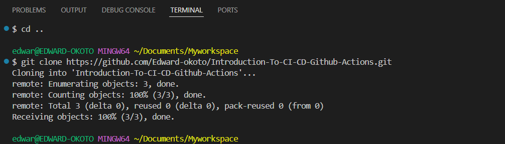
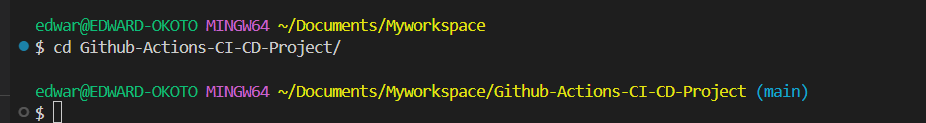
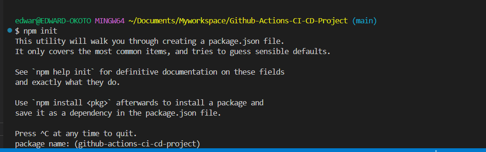
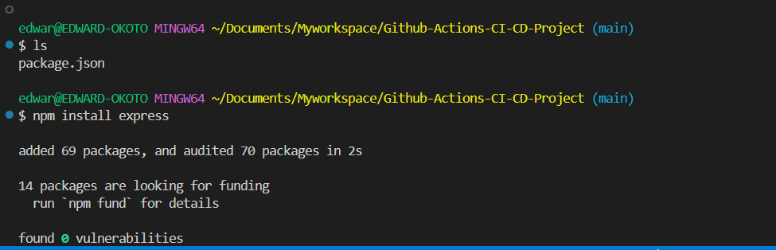
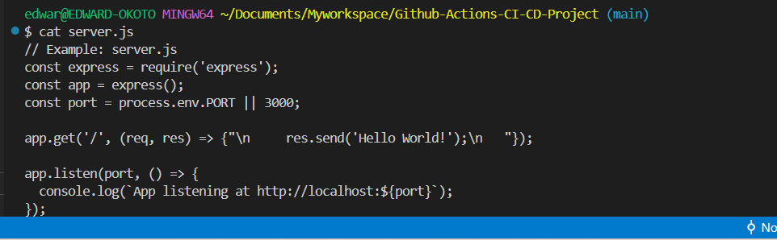

# Introduction-To-CI/CD-Github-Actions.

GitHub Actions is a powerful tool for automating tasks within your repositories. It's widely used for implementing Continuous Integration and Continuous Deployment (CI/CD) pipelines, which streamline the development process by automating code testing, building, and deployment.

With CI/CD pipelines, changes made to code are automatically tested and validated, ensuring quality and reducing the likelihood of errors. GitHub Actions allows developers to define workflows in YAML files, specifying triggers (such as a push to a branch) and actions (like running tests or deploying an application).

By integrating GitHub Actions and CI/CD, teams can collaborate efficiently, ship code faster, and maintain a high level of reliability in their software development processes.

#### Why is this relevant to LEARNERS

The relevance of GitHub Actions and CI/CD pipelines lies in their ability to improve software development efficiency, quality, and collaboration:

1. **Automation of Repetitive Tasks**: They eliminate manual steps like testing, building, or deployment, allowing developers to focus on writing code.

2. **Continuous Feedback**: CI/CD pipelines provide immediate feedback on code changes, helping teams catch bugs early and ensure the reliability of their applications.

3. **Faster Delivery**: Automation accelerates the process of deploying new features and updates, enabling quicker time-to-market.

4. **Collaboration**: Teams can work more cohesively, as GitHub Actions integrates seamlessly into pull requests and version control workflows.

By streamlining the development and deployment process, these tools are essential for modern software engineering teams aiming to build robust and scalable applications.

#### Practical Implementation

**Setting up the project**.

1.**Initialize a Git repository**.

- Create a new repository on GITHUB
Create a New Repository on GitHub:

  a)Log in to your GitHub account.

  b)Click the + icon in the top-right corner and select New Repository.

  c)Fill in the repository name, description, and visibility (public or private).

  d)Do not check the box to add a README, .gitignore, or license, as you'll set these up locally.

  e)Click Create Repository. 

  

- Clone it to your local machine.

  a)Copy the repository URL from GitHub.

   

  b)Open your terminal and run:

        git clone <repository_url>

        cd <repository_name>
    
    

2.**Create a simple Node.js application**

  - Install [Node.js](https://nodejs.org/en?form=MG0AV3) if its not already Installed:

  - verify installation:

        node -v

        npm -v


- Initialize a Node.js project `npm init`
  
  Follow the prompts to set up `package.json`. You can press `Enter` for defaults.
  
- Create a simple server using `Express.js` to server a static web page

  a)Install `Express.js`, a popular web framework for Node.js:

        npm install express

     

  b) Create a `server.js` file:

  
    ```javascript
    // Example: index.js
    const express = require('express');
    const app = express();
    const port = process.env.PORT || 3000;

        app.get('/', (req, res) => {
  res.send('Hello World!');
    });

    app.listen(port, () => {
  console.log(`App is running at http://localhost:${port}`);
    });


- Add your page to the repository and push it to github.

  

3.**Write your GitHub action workflow**

- Create a `.github/workflow` in your repository

   a) In the root of your git repository,create the .github/workflow directory.

        mkdir -p .github/workflows
    
    

    b) Navigate to the workflows directory:

        cd .github/workflows
 
- Add a workflow file called `node.js.yml`

        touch node.js.yml

       


```yaml
# Name of the workflow
name: Node.js CI

# Specifies when the workflow should be triggered
on:
# Triggers the workflow on 'push' events to the 'main' branch
push:
    branches: [ main ]
# Also triggers the workflow on 'pull_request' events targeting the 'main' branch
pull_request:
    branches: [ main ]

# Defines the jobs that the workflow will execute
jobs:
# Job identifier, can be any name (here it's 'build')
build:
    # Specifies the type of virtual host environment (runner) to use
    runs-on: ubuntu-latest

    # Strategy for running the jobs - this section is useful for testing across multiple environments
    strategy:
    # A matrix build strategy to test against multiple versions of Node.js
    matrix:
        node-version: [14.x, 16.x]

    # Steps represent a sequence of tasks that will be executed as part of the job
    steps:
    - # Checks-out your repository under $GITHUB_WORKSPACE, so the job can access it
    uses: actions/checkout@v2

    - # Sets up the specified version of Node.js
    name: Use Node.js ${{ matrix.node-version }}
    uses: actions/setup-node@v1
    with:
        node-version: ${{ matrix.node-version }}

    - # Installs node modules as specified in the project's package-lock.json
    run: npm ci

    - # This command will only run if a build script is defined in the package.json
    run: npm run build --if-present

    - # Runs tests as defined in the project's package.json
    run: npm test
```

Explanation:

---

##### **Workflow Name**
```yaml
name: Node.js CI
```
- This specifies the name of the workflow. The name appears in the GitHub Actions dashboard, helping you identify the workflow.

---

##### **Workflow Trigger**
```yaml
on:
  push:
    branches: [ main ]
  pull_request:
    branches: [ main ]
```
- **`push:`**: The workflow is triggered when code is pushed to the `main` branch.
- **`pull_request:`**: The workflow is triggered when a pull request is opened, synchronized, or updated targeting the `main` branch.

---

##### **Job Definition**
```yaml
jobs:
  build:
    runs-on: ubuntu-latest
```
- **`jobs:`**: Defines the tasks (jobs) to be executed in the workflow. Each job can run independently.
- **`build:`**: The job identifier, which can be any name. In this case, it's `build`.
- **`runs-on:`**: Specifies the type of virtual machine environment to run the job. Here, it uses the latest Ubuntu environment (`ubuntu-latest`).

---

##### **Strategy for Matrix Builds**
```yaml
strategy:
  matrix:
    node-version: [14.x, 16.x]
```
- **`strategy:`**: Defines how the job runs across different configurations.
- **`matrix:`**: Creates a matrix of configurations for testing. The job will run multiple times, once for each version of Node.js (`14.x` and `16.x`).

---

##### **Steps**
```yaml
steps:
  - uses: actions/checkout@v2
```
- **`steps:`**: Defines the sequence of tasks to execute within the job.
- **`actions/checkout@v2:`**: Checks out the code from the repository into the workspace so that subsequent steps can access it.

---

##### **Set Up Node.js**
```yaml
- name: Use Node.js ${{ matrix.node-version }}
  uses: actions/setup-node@v1
  with:
    node-version: ${{ matrix.node-version }}
```
- **`name:`**: Provides a readable description for the step. It dynamically includes the Node.js version being tested.
- **`uses:`**: Specifies the GitHub Action to use. Here, it sets up Node.js with `actions/setup-node@v1`.
- **`with:`**: Supplies parameters for the action. The `node-version` parameter defines which version of Node.js to install, using the matrix variable.

---

##### **Install Dependencies**
```yaml
- run: npm ci
```
- **`run:`**: Executes shell commands. Here, `npm ci` installs dependencies listed in the `package-lock.json` file to ensure consistent builds.

---

##### **Build the Application**
```yaml
- run: npm run build --if-present
```
- Runs the build command defined in the `package.json` file, if it exists (`--if-present` ensures the workflow doesn't fail if there isn't a build script).

---

##### **Run Tests**
```yaml
- run: npm test
```
- Runs the test scripts defined in the `package.json` file to validate the application's functionality.

---

Each component works together to automate the testing and validation of your Node.js application. 

4.**Testing and Deployment**

 - Add automated test for your application
 - Create a workflow for deployment to AWS


5.**Experiment and Learn**

- Modify workflow to see how changes affect the CI/CD process
- Try adding different types of test (Unit test,integration test)